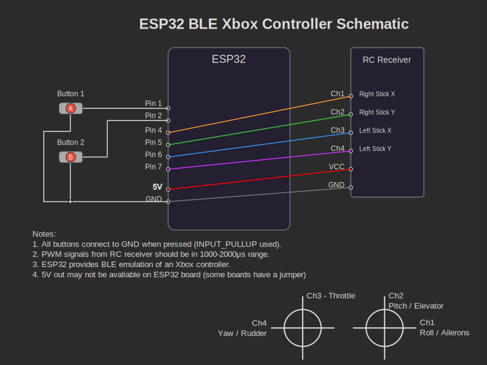

# ESP32 RC Receiver to Bluetooth XBox Controller

This project sets up an ESP to run as a gamepad controller over bluetooth.



With the default config on a FlySky i6 transmitter this seems to work well with
RealFlight. I have not really tested the functionality of the A and B button...
I added those to the code for later but never needed them so left them unwired.

If the axis mapping doesn't work for you, try modifying the following in [main.cpp](./src/main.cpp):

```c++
    // ... ~ line 240
    
    // Map first 4 PWM inputs to controller axes
    int L_x = mapPWMToAxis(pwmValues[2]);
    int L_y = -mapPWMToAxis(pwmValues[3]);
    int R_x = mapPWMToAxis(pwmValues[0]);
    int R_y = -mapPWMToAxis(pwmValues[1]);
    
    // NOTE: mapping to xbox axes doesn't make much sense reading the axis names below:
    bleGamepad.setX(0);
    bleGamepad.setY(0);
    bleGamepad.setZ(R_x);
    bleGamepad.setRX(L_x);
    bleGamepad.setRY(L_y);
    bleGamepad.setRZ(R_y);

    
    // Send report
    bleGamepad.sendReport();

    // ...
```
